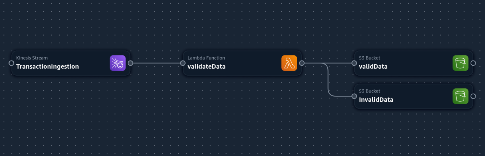

# AWS severless fraud detection experiment

This is a simple serverless application experiment that,
- Builds and pushes Images of specified sub directories to ECR for lambda
- Uses cloudformation and github actions to deploy the serverless Infra
- contains Jupyter Notebooks on possible ML solutions for fraud detection problem
- and notes on the problem

## Prerequisites
- [AWS Vault](https://github.com/99designs/aws-vault)
- [AWS CLI](https://docs.aws.amazon.com/cli/latest/userguide/getting-started-install.html)
- [uv] (https://docs.astral.sh/uv/getting-started/installation/)

## Steps to run the experiment 

### Setting up the project
- Clone the repository
- Install the Pre-requisites
- Run `uv run pytest` this will automatically create an environment and install all dependencies mentioned in the pyproject.toml file.

### Deploy the application
- Create a GitHub Actions workflow that will trigger on every push to the main branch.

### Deploying to your own AWS account
You can deploy from local by running github actions locally,
- Setup [nektos/act](https://github.com/nektos/act) this helps you run GitHub Actions locally. 
- Install Docker, nektos/act uses docker to run your workflows.
- And if you are using vscode you can install [Github Local Actions Docs](https://sanjulaganepola.github.io/github-local-actions-docs/) for a helpful UI to run this. (this is how I was testing my workflows locally) 

Alternatively, you can run with your own github actions
- Fork the repo and add in `AWS_ACCESS_KEY_ID` and `AWS_SECRET_ACCESS_KEY` to Actions secrets.
- Run the workflow using your github actions. 

## What it will deploy?
- A cloud formation application `fraud-detection` with the following resources:

## Testing the cloudformation application
You can use `utils/simulate_events.py` to simulate events and test the cloudformation application.

- Activate the environment with `source .venv/bin/activate`, if you don't have a virtualenv, create one with `uv run pytest`.
- Add AWS accont information to the session using aws-vault `aws-vault exec <profile name> --region <region name>` this for me turns out to be `aws-vault exec personal --region ca-central-1` personal being my profile and ca-central-1 being my region.
- Now run `uv run python utils/simulate_events.py --stream-name fraud-detection-TransactionIngestion-mHXRRNzZAWJV --num-transactions 1000`

The simulate.py pushes transactions events random some with error in the transaction-id format and some in the correct format, you should observe data being pushed into both your valid and invalid s3 buckets.
