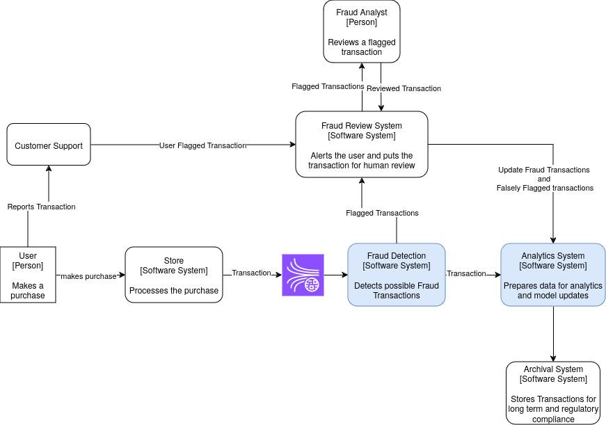

img {
background-color: white;
}

# Scenario

pipeline that detects potentially fraudulent transactions in real time and processes it for insights

## Transaction events

- Are generated after the purchase has been made .i.e. it's live
- JSON format
```json
{
"transaction_id": "T12345",
"user_id": "U56789",
"timestamp": "2025-01-01T12:00:00Z",
"amount": 254.67,
"device_type": "mobile",
"location": "California, USA",
"is_vpn": false,
"card_type": "credit",
"status": "approved"
}
```
- Transaction Id, unique to the transaction
- user_id -> user identifier, a user can have multiple transactions
- timestamp -> When the transaction is made, this can be a good ML feature
- amount -> the price of the total purchase, The currency is not given so for now assuming a universal currency for the system
- device type -> from which device the transaction came (new devices, should be reviewed)
- location -> where the transaction came from for the user, This is limited to the state only possibly due to privacy concerns but it would still be a good feature
- is_vpn -> Whether vpn was used in the transaction or not, can again be a good feature to flag on by default
- card_type -> credit/debit
- status -> What is the current status of the transaction, now 


## System Context Diagram


Blue marks the systems we are aiming to build

## Fraud Detection System


